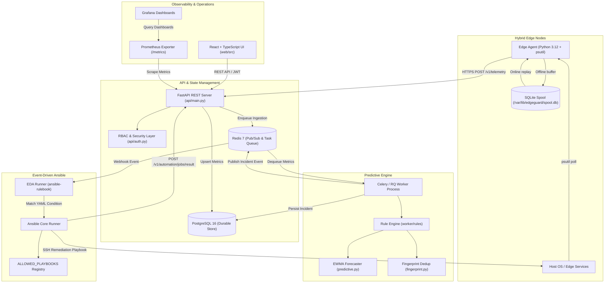
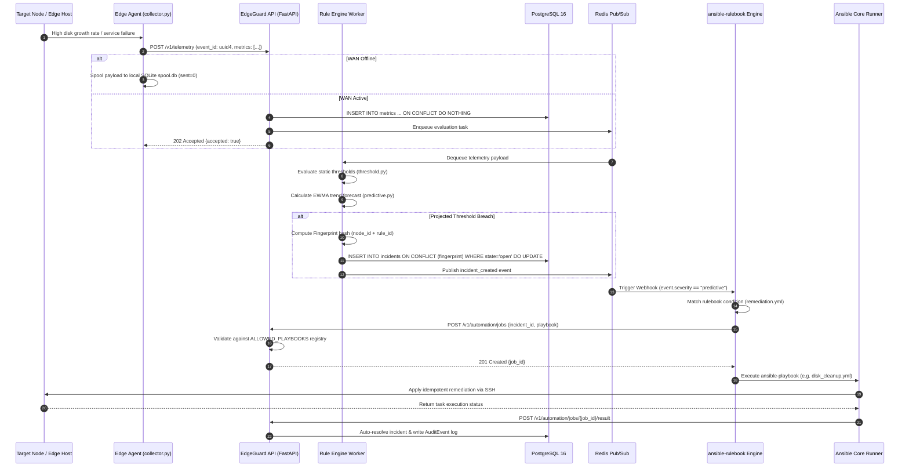

# EdgeGuard — Red Hat-Oriented Edge Monitoring & Self-Healing Platform

> **EdgeGuard** is an enterprise hybrid-edge monitoring and self-healing remediation platform built around **Red Hat Event-Driven Ansible (EDA)** and **predictive trend-based alerting** (inspired by Red Hat Insights).

---

## Executive Summary & Key Differentiators

EdgeGuard decouples telemetry detection from automation execution, ensuring that operational remediation rules are declared in YAML rulebooks rather than buried in application code.

1. **Event-Driven Ansible (EDA) Integration**:
   - Remediation trigger decisions are offloaded to an `ansible-rulebook` runner (`eda/rulebooks/remediation.yml`).
   - New remediation policies require zero application code deploys—simply update the YAML rulebook.
2. **Predictive EWMA Trend Detection**:
   - Uses Exponentially Weighted Moving Average (EWMA) with linear trend extrapolation ($\alpha = 0.3$) to forecast metric threshold breaches up to 6 hours in advance.
   - Triggers `severity: predictive` incidents before disk fill, memory exhaustion, or service failure occurs.
3. **Offline-First WAN Resilience**:
   - Python 3.12 edge agent buffers telemetry in a local SQLite database (`/var/lib/edgeguard/spool.db`) in WAL mode during network outages.
   - Automatically replays pending telemetry upon reconnect with zero duplicate rows via UUID `event_id` server-side idempotency.
4. **Strict Security Model & Auditability**:
   - Enforces a server-side `ALLOWED_PLAYBOOKS` allow-list registry to prevent unauthorized command or playbook injection.
   - Multi-tenant RBAC (`viewer`, `operator`, `admin`) paired with an immutable `audit_events` ledger recording all human and automated actions.

---

## Technology Stack & Framework Matrix

| Layer / Component | Technology | Version / Specification | Responsibilities & Value |
|---|---|---|---|
| **Control Plane API** | FastAPI / ASGI | Python 3.12 / FastAPI 0.115+ | High-throughput async REST API serving ingestion, RBAC, nodes, and job orchestration. |
| **Data Validation & Contracts** | Pydantic | v2.10+ | Strict type checking, request body serialization, and automated OpenAPI spec generation. |
| **Database ORM & Access** | SQLAlchemy | 2.0+ Async & Sync | Database abstraction layer managing PostgreSQL connection pooling and schemas. |
| **Durable Database Store** | PostgreSQL | 16.x | Enterprise transactional storage for nodes, metrics, incidents, jobs, and audit events. |
| **Task Queue & Event Bus** | Celery / RQ & Redis | Redis 7.x | Asynchronous background metric evaluation, trend forecasting, and Pub/Sub event distribution. |
| **Edge Agent Collector** | Python / `psutil` | Python 3.12 / `psutil` 6.1 | Lightweight daemon polling host metrics (CPU, memory, disk, network) and systemd services. |
| **Offline Spooling Database** | SQLite | 3.46+ (WAL mode) | Embedded transaction log (`spool.db`) buffering telemetry locally during WAN drops. |
| **Event-Driven Automation** | Event-Driven Ansible | `ansible-rulebook` 1.1+ | Rulebook processing engine matching webhook incident events against declarative YAML rules. |
| **Ansible Execution Engine** | Ansible Core | `ansible-runner` 2.4+ | Idempotent automation execution over SSH to remediate target edge systems. |
| **Frontend Control Dashboard** | React + TypeScript | React 18.3 / TS 5.6 | Single-Page Application (SPA) built with Vite for fleet monitoring and manual triggers. |
| **Styling & UI Components** | Vanilla CSS & Lucide | Modern CSS / Lucide Icons | Responsive glassmorphism interface with custom dark mode theme and dynamic indicators. |
| **Security & Authentication** | OAuth2 / JWT & Keycloak | OIDC Standard / PyJWT | Dual-mode auth supporting local JWT signed tokens and enterprise Keycloak OIDC SSO. |
| **Container & Orchestration** | Docker / K8s | Docker Engine 27+ / K8s | Containerized deployment blueprints with Kubernetes deployment, service, and ingress manifests. |
| **Observability Integration** | Prometheus & Grafana | Prometheus v2 / Grafana | Native `/metrics` scrapable endpoint and pre-built Grafana operational dashboards. |

---

## 1. High-Level Architecture & Data Flows

### Component Architecture Map



---

### End-to-End Self-Healing Sequence Diagram



---

## 2. Repository Architecture & Directory Structure

```
edgeguard/
├── agent/                            # Lightweight Edge Collector Daemon
│   ├── collector.py                  # Telemetry polling via psutil (CPU, memory, disk, network, systemd)
│   ├── spool.py                      # SQLite WAL transaction engine for durable offline buffering
│   ├── sender.py                     # HTTPS client with exponential backoff & jitter replay
│   └── service/
│       └── edgeguard-agent.service   # Systemd unit configuration file
├── api/                              # FastAPI Control Plane Server
│   ├── main.py                       # Application init, CORS middleware, router mounts, health check
│   ├── db.py                         # SQLAlchemy async engine & connection pool setup
│   ├── models.py                     # PostgreSQL database schema definitions
│   ├── schemas.py                    # Strict Pydantic v2 validation contracts
│   ├── auth.py                       # JWT auth, password hashing, and RBAC hierarchy enforcement
│   ├── auth_keycloak.py              # Keycloak OpenID Connect (OIDC) integration provider
│   └── routers/
│       ├── nodes.py                  # Node registration & heartbeat lifecycle management
│       ├── telemetry.py              # Ingestion pipeline endpoint with event_id idempotency
│       ├── incidents.py              # Incident management & manual resolution API
│       ├── automation.py             # Playbook execution & job callback API
│       └── audit.py                  # Immutable security audit log query API
├── worker/                           # Asynchronous Evaluation Worker
│   ├── tasks/ingest.py               # Batch metric ingestion tasks
│   ├── tasks/evaluate.py            # Async rule evaluation entrypoint
│   ├── rules/threshold.py            # Hard static threshold checking logic
│   ├── rules/predictive.py           # EWMA trend forecaster & breach projector
│   ├── rules/fingerprint.py          # Deterministic SHA-256 fingerprint hash generator
│   └── eventbus.py                   # Redis Pub/Sub message broker wrapper
├── eda/                              # Event-Driven Ansible (EDA) Layer
│   ├── rulebooks/remediation.yml     # Event-Driven Ansible YAML policy rulebook
│   └── inventory/hosts.yml           # Ansible inventory target mapping
├── automation/                       # Automation Playbooks & Security Registries
│   ├── ALLOWED_PLAYBOOKS.py          # Server-side security allow-list registry
│   ├── playbooks/                    # Ansible playbooks (disk_cleanup, restart_service, etc.)
│   └── roles/                        # Modular Ansible remediation roles
├── web/                              # React + TypeScript Frontend Dashboard
│   ├── src/pages/                    # Fleet, Incidents, Automation, and Audit views
│   └── src/components/               # Glassmorphic UI components & navigation
├── infra/                            # Infrastructure Deployment Blueprint
│   ├── docker-compose.yml            # Complete container orchestration setup
│   ├── docker-compose.keycloak.yml   # Enterprise Keycloak SSO stack configuration
│   ├── k8s/                          # Kubernetes Deployment, Service, Secret & NetworkPolicy manifests
│   └── grafana/                      # Pre-built Grafana operational visualization dashboards
└── tests/                            # Comprehensive Test Suite
    ├── unit/                         # Core algorithm & rule engine unit tests
    ├── integration/                  # Database, Redis queue & API integration tests
    └── e2e/                          # End-to-End drift detection & autocorrect tests
```

---

## 3. Database Schemas (PostgreSQL 16)

```sql
-- Nodes Registry Table
CREATE TABLE nodes (
    id UUID PRIMARY KEY DEFAULT gen_random_uuid(),
    hostname VARCHAR(255) NOT NULL UNIQUE,
    site VARCHAR(100) NOT NULL,
    environment VARCHAR(50) NOT NULL,
    os VARCHAR(100) NOT NULL,
    agent_version VARCHAR(50) NOT NULL,
    status VARCHAR(50) NOT NULL DEFAULT 'registered',
    last_seen TIMESTAMPTZ NOT NULL DEFAULT CURRENT_TIMESTAMP
);

-- Time-Series Telemetry Table
CREATE TABLE metrics (
    id BIGSERIAL PRIMARY KEY,
    node_id UUID NOT NULL REFERENCES nodes(id) ON DELETE CASCADE,
    timestamp TIMESTAMPTZ NOT NULL,
    metric_name VARCHAR(100) NOT NULL,
    value DOUBLE PRECISION NOT NULL,
    labels JSONB DEFAULT '{}'::jsonb
);
CREATE INDEX idx_metrics_node_time ON metrics(node_id, timestamp DESC);
CREATE INDEX idx_metrics_name_time ON metrics(metric_name, timestamp DESC);

-- Incidents Management Table
CREATE TABLE incidents (
    id UUID PRIMARY KEY DEFAULT gen_random_uuid(),
    node_id UUID NOT NULL REFERENCES nodes(id) ON DELETE CASCADE,
    fingerprint VARCHAR(64) NOT NULL,
    severity VARCHAR(20) NOT NULL CHECK (severity IN ('predictive', 'warning', 'critical')),
    state VARCHAR(20) NOT NULL DEFAULT 'open' CHECK (state IN ('open', 'remediating', 'resolved', 'escalated')),
    rule VARCHAR(100) NOT NULL,
    occurrence_count INT NOT NULL DEFAULT 1,
    created_at TIMESTAMPTZ NOT NULL DEFAULT CURRENT_TIMESTAMP,
    resolved_at TIMESTAMPTZ
);
CREATE UNIQUE INDEX idx_incidents_unique_open ON incidents(fingerprint) WHERE state = 'open';

-- Automation Jobs Audit Table
CREATE TABLE automation_jobs (
    id UUID PRIMARY KEY DEFAULT gen_random_uuid(),
    incident_id UUID REFERENCES incidents(id) ON DELETE SET NULL,
    playbook VARCHAR(255) NOT NULL,
    status VARCHAR(50) NOT NULL DEFAULT 'queued',
    triggered_by VARCHAR(50) NOT NULL CHECK (triggered_by IN ('eda', 'manual')),
    started_at TIMESTAMPTZ,
    finished_at TIMESTAMPTZ,
    result JSONB
);

-- Security Audit Log Ledger
CREATE TABLE audit_events (
    id BIGSERIAL PRIMARY KEY,
    actor_id VARCHAR(255) NOT NULL,
    action VARCHAR(100) NOT NULL,
    resource_type VARCHAR(100) NOT NULL,
    resource_id VARCHAR(255) NOT NULL,
    result VARCHAR(50) NOT NULL,
    timestamp TIMESTAMPTZ NOT NULL DEFAULT CURRENT_TIMESTAMP
);
```

---

## 4. Algorithmic Specifications & Mathematics

### 4.1 Exponentially Weighted Moving Average (EWMA) Forecasting

The predictive engine continuously calculates smoothed metric averages and extrapolates linear rates of change:

1. **EWMA Smoothing Calculation**:
   $$EWMA_t = \alpha \cdot X_t + (1 - \alpha) \cdot EWMA_{t-1}$$
   *Default smoothing coefficient: $\alpha = 0.3$*

2. **Metric Delta Trend**:
   $$\Delta_{trend} = EWMA_t - EWMA_{t-1}$$

3. **Horizon Projection**:
   $$P_{future} = EWMA_t + (\Delta_{trend} \times H_{minutes})$$

4. **Breach Decision Rule**:
   $$\text{Trigger Incident} \iff P_{future} \ge \text{Threshold}$$

---

### 4.2 Deduplication Fingerprint Hash

To prevent incident duplication and database row bloat during high-frequency sampling:

$$\text{Fingerprint} = \text{SHA256}(\mathtt{node\_id} \mathbin{\Vert} \text{":"} \mathbin{\Vert} \mathtt{rule\_id})$$

Enforced in PostgreSQL via a partial unique index on open state incidents (`WHERE state = 'open'`), forcing duplicate open breaches to update `occurrence_count` and `updated_at`.

---

## 5. Security Guardrails & Threat Mitigations Audit

| Risk / Failure Vector | Root Cause | System Mitigation & Guardrail |
|---|---|---|
| **Playbook Injection Attack** | Malicious HTTP payload attempting execution of unauthorized scripts | Server-side validation against `ALLOWED_PLAYBOOKS` list (`api/routers/automation.py`). Returns `403 Forbidden` for unregistered playbooks. |
| **WAN Disconnection Data Loss** | Edge node isolated from central API control plane | Durable SQLite spool (`agent/spool.py`) buffers metrics locally in WAL mode until network reconnection. |
| **Replay Ingestion Duplication** | Agent retrying buffered metric batches upon reconnect | Server-side idempotency tracking client-side UUID `event_id` headers. |
| **Flapping Alert Storms** | Metrics fluctuating rapidly around threshold limits | Partial unique index fingerprint deduplication aggregates recurring events into existing open incidents. |
| **Remediation Loop Deadlock** | Automation playbook fails to resolve issue | Strict job limit (max 3 runs per incident). Escalates incident state to `escalated` if health re-checks fail. |

---

## 6. Quick Start & Local Execution

### 6.1 Local Stack Setup (Docker Compose)

```bash
# 1. Enter project directory
cd edgeguard

# 2. Copy environment variable template
cp .env.example .env

# 3. Spin up API, Worker, EDA Runner, Postgres 16, Redis 7, Prometheus & Grafana
docker compose up -d --build

# 4. Verify API health status
curl http://localhost:8000/health
# Response: {"status":"ok","version":"0.1.0"}
```

### 6.2 Running Automated Test Suite

```bash
# Run unit, integration, and E2E tests
pytest tests/ -v
```

---

## 7. Built vs. Designed Feature Audit Matrix

| Feature Component | Status | Implementation File Location |
|---|---|---|
| **FastAPI REST API Surface** | Built | `api/main.py`, `api/routers/` |
| **PostgreSQL Schema & Dedupe** | Built | `api/models.py`, DB migrations |
| **EWMA Predictive Forecaster** | Built | `worker/rules/predictive.py` |
| **Agent SQLite Spooling & Replay** | Built | `agent/spool.py`, `agent/sender.py` |
| **Ansible Playbook Automation** | Built | `automation/playbooks/`, `ALLOWED_PLAYBOOKS.py` |
| **Event-Driven Ansible Rulebook** | Built | `eda/rulebooks/remediation.yml` |
| **Kubernetes Infrastructure Specs** | Built | `infra/k8s/` |
| **Prometheus & Grafana Setup** | Built | `infra/grafana/`, FastAPI `/metrics` |
| **React + TypeScript Control UI** | Built | `web/src/` |
| **Keycloak OIDC Swap Support** | Built | `api/auth_keycloak.py`, `infra/docker-compose.keycloak.yml` |
