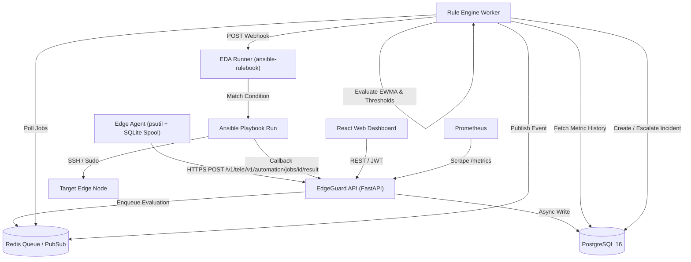
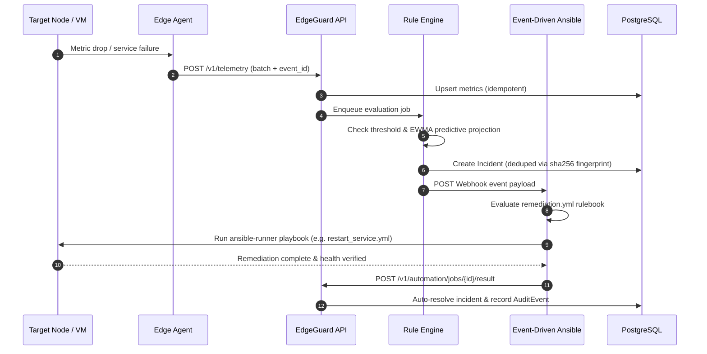

# EdgeGuard Architecture & System Specification

## 1. High-Level Architecture

EdgeGuard decouples telemetry collection, predictive detection, event-driven remediation, and audit logging into a modular micro-service architecture.

---

## 2. End-to-End Self-Healing Remediation Cycle

---

## 3. Mathematical Extrapolation & Deduplication

### EWMA Forecasting Formula
$$EWMA_t = \alpha \cdot X_t + (1 - \alpha) \cdot EWMA_{t-1} \quad (\alpha = 0.3)$$
$$\text{Projected Value } P = EWMA_t + (EWMA_t - EWMA_{t-1}) \times H_{minutes}$$

### Fingerprint Hashing Formula
$$\text{Fingerprint} = \text{SHA256}(\text{node\_id} + \text{":"} + \text{rule\_id})$$
Enforced by DB Index: `CREATE UNIQUE INDEX ix_incidents_open_fingerprint ON incidents(fingerprint) WHERE state = 'open';`

---

## 4. Security & Isolation Controls
- **`ALLOWED_PLAYBOOKS` Registry**: Reject execution requests for playbooks not explicitly allow-listed in application config (`api/routers/automation.py`).
- **RBAC Roles**: `viewer` (read-only), `operator` (trigger remediation), `admin` (full system management & node deletion).
